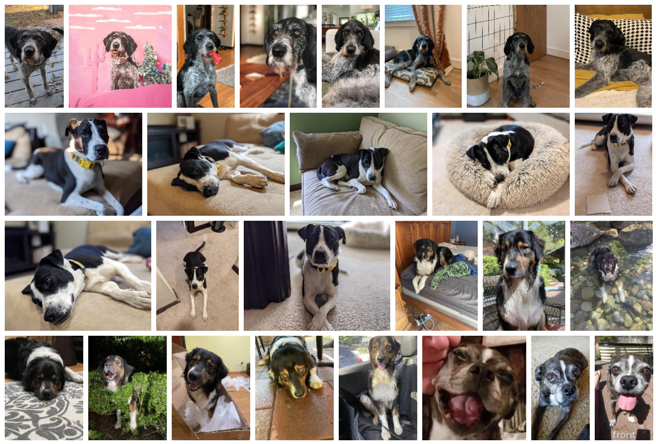

# Scenario: The Mutt Matcher (IoT version)

According to the World Health Organization there are more than 200 million stray dogs worldwide. The American Society for the Prevention of Cruelty to Animals estimates over 3 million dogs enter their shelters annually.

Different breeds have different needs, or react differently to people, so when a stray or lost dog is found, identifying the breed can be a great help.

Your team has been asked by a fictional animal shelter to build a Mutt Matcher - a device to help determine the breed of a dog when it has been found. This will be an IoT (Internet of Things) device based around a Raspberry Pi with a camera, and will take a photo of the dog, and then use an image classifier Machine learning (ML) model to determine the breed. This device will help workers and volunteers to be able to quickly detect the breed and make decisions on the best way to approach and care for the dog.

The animal shelter has provided [a set of images](./model-images) for a range of dog breeds to get you started. These can be used to train the ML model using a service called Custom Vision.

## Prerequisites

Each team member will need an Azure account. With [Azure for Students](https://azure.microsoft.com/free/students/?WT.mc_id=academic-36256-jabenn), you can access $100 in free credit, and a large suite of free services!

Your team should be familiar with the following:

- Git and GitHub
  - [Forking](https://docs.github.com/github/getting-started-with-github/quickstart/fork-a-repo) and [cloning](https://docs.github.com/github/creating-cloning-and-archiving-repositories/cloning-a-repository-from-github/cloning-a-repository) repositories

- [Python](https://channel9.msdn.com/Series/Intro-to-Python-Development?WT.mc_id=academic-36256-jabenn)

### Hardware

To complete this workshop fully, ideally you will need a [Raspberry Pi (model 3 or 4)](https://www.raspberrypi.org/products/raspberry-pi-4-model-b/), and a camera. The camera can be a [Raspberry Pi Camera module](https://www.raspberrypi.org/products/camera-module-v2/), or a USB web cam.

> 💁 If you don't have a Raspberry Pi, you can run this workshop using a PC or Mac to simulate an IoT device, with either a built in or external webcam.

### Software

Each member of your team will also need the following software installed:

- [Git](https://git-scm.com/downloads)
  - [Install git on macOS](https://git-scm.com/download/mac)
  - [Install git on Windows](https://git-scm.com/download/win)
  - [Install git on Linux](https://git-scm.com/download/linux)

- [Visual Studio Code](https://code.visualstudio.com/?WT.mc_id=academic-36256-jabenn)

## Resources

A series of resources will be provided to help your team determine the appropriate steps for completion. The resources provided should provide your team with enough information to achieve each goal. If you get stuck, you can always ask a mentor for additional help.

## Exploring the application

The application consists of 3 components:

- An image classifier running in the cloud using Microsoft Custom Vision

- An IoT application running in the cloud using Azure IoT Central

- A Raspberry Pi based IoT device with a camera

When a dog breed needs to be detected:

1. A button on the IoT application is clicked

1. The IoT application sends a command to the IoT device to detect the breed

1. The IoT device captures an image using it's camera

1. The image is sent to the image classifier ML model in the cloud to detect the breed

1. The results of the classification are sent back to the IoT device

1. The detected breed is sent from the IoT device to the IoT application

## Goals

Your team will set up the Pi, ML model and IoT application, then connect everything to gether by deploying code to the IoT device.

1. [Set up your Raspberry Pi and camera](set-up-pi.md): You will need to set up a clean install of Raspberry Pi OS on your Pi and ensure all the required software is installed.
    > If you are using a PC or Mac instead of a Pi, your team will need to set this up instead.

1. [Train your AI model](train-model.md): Your team will need to train the AI model in the cloud using Microsoft Custom Vision. You can train and test this model using the images that have been provided by the animal shelter.

1. [Set up your IoT application](set-up-iot-central.md): Your team will set up an IoT application in the cloud using IoT Central, an IoT software-as-a-service (SaaS) platform.

1. [Deploy code to your IoT device](deploy-device-code.md): The code for the IoT device needs to be configured and deployed to the Raspberry Pi. You will then be able to test out your application.

## Validation

This workshop is designed to be a goal-oriented self-exploration of Azure and related technologies. Your team can validate by using the IoT device to take a picture of one of the provided testing images and ensuring the correct result appears in the IoT application.

## Where do we go from here?

As highlighted earlier, we are looking to provide inspiration to hackers on what can be done with Azure and other products. Other uses for similar IoT devices that use image classification include:

- Trash sorting into landfill, recycling, and compost

- Identification of disease in plant leaves

- Detecting skin cancer by classification of moles
