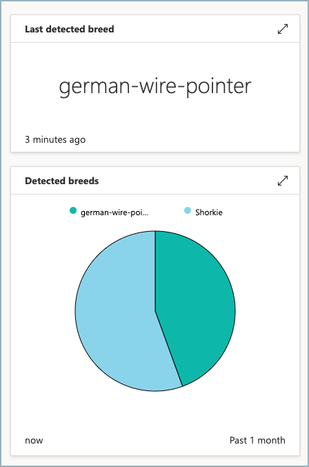

# Goal 2: Set up your IoT application

The Mutt Matcher is an IoT device, so needs to connect to an IoT service in the cloud. This service will control the IoT device - sending commands to the device to take a picture and classify it, then store the results and make them available on a dashboard.

The goal of this section is to deploy an IoT Central application and create a device.

## The Azure Service

Azure IoT Central is an IoT software-as-a-service (SaaS) application. You can use it to create an IoT application in the cloud that can manage IoT devices, as well as communicating with those devices. You can use it to define *device templates* that define that telemetry data an IoT device will send, and what commands you can send to that device to control it. You can then define the devices, ensuring you have control over what physical IoT devices will connect to your IoT application. You can also set up views and dashboards to visualize the data send from your devices.

For this workshop, you will need an IoT application that has a device template for Mutt Matchers, defining a command that instructs the device to take a picture and detect the breed, and telemetry data that the device will send with the detected breed. Your application will then need a dashboard to allow you to run the command, as well as see the last detected breed and a history of detected breeds. Inside your application, you will need to define a device that represents your Raspberry Pi, and this device has connection details that will allow your Raspberry Pi to connect.

## Application template

Rather than build your application and device template from scratch, you can use a pre-built template to help. Select the button below to deploy the application.

Set your applications name to `Mutt Matcher`, then set a unique URL, then select a pricing plan.

Once your application has been deployed, you will need to set up a device using the `mutt-matcher` device template that is already defined in the application. You can use this device to get connection details for your Mutt Matcher.

## Success criteria

Your team will work together to create the IoT application and set up your Mutt Matcher device. Your team will have achieved this goal when the following success criteria is met:

- Your IoT Central application is deployed.
- You have created a device using the `mutt-matcher` device template.
- You have the connection details needed for your IoT device to connect as the created device in the IoT Central application.

## Validation

## Resources

Your team might find these resources helpful:

- [Use an application template guide in the IoT Central documentation](https://docs.microsoft.com/azure/iot-central/core/howto-create-iot-central-application?WT.mc_id=academic-36256-jabenn#use-an-application-template)
- [Add a device guide in the IoT Central documentation](https://docs.microsoft.com/azure/iot-central/core/howto-manage-devices-individually?WT.mc_id=academic-36256-jabenn#add-a-device)
- [Register a single device in advance guide in the IoT Central documentation](https://docs.microsoft.com/azure/iot-central/core/concepts-get-connected?WT.mc_id=academic-36256-jabenn#register-a-single-device-in-advance)

## Tips

- Make sure you select the `mutt-matcher` device template when creating your new device
- You will only be using one device, so it doesn't matter which pricing plan you use, they will all be free for 1 device.
- The application URL needs to be globally unique, so don't use `mutt-matcher`!

## Final result

## Next challenge

The next goal is to [deploy your code to your an IoT device](./deploy-device-code.md).
